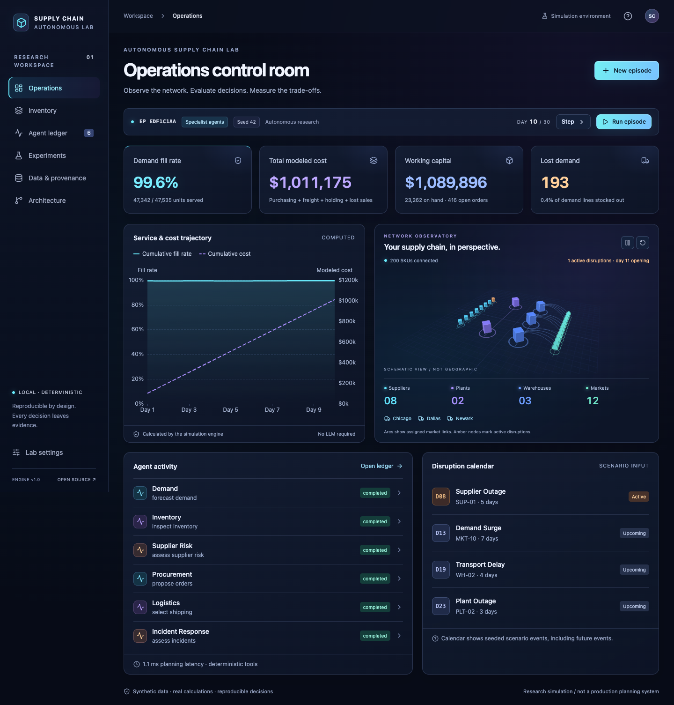
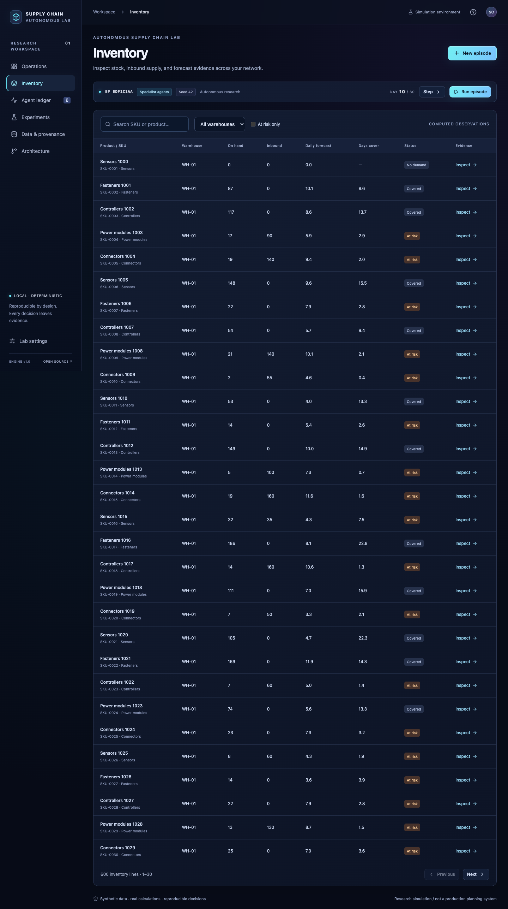
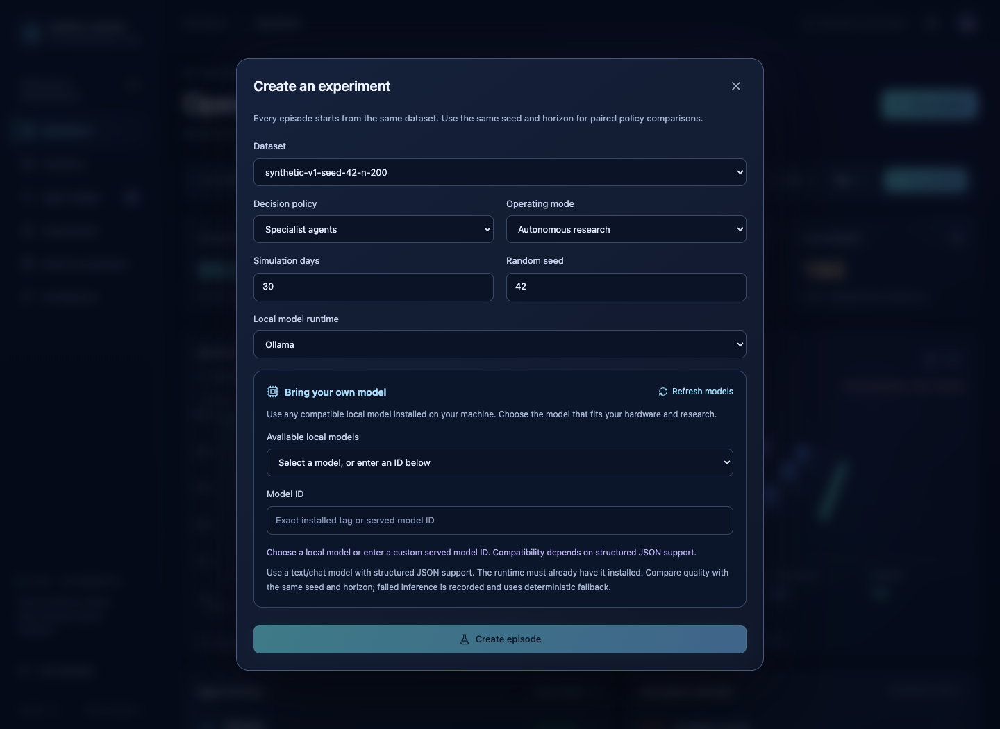
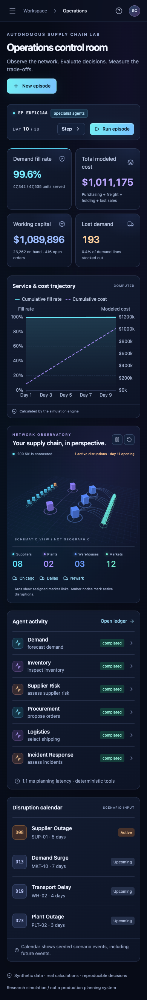
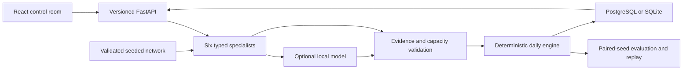

<p align="center">
  
</p>

<p align="center">
  <strong>Can your AI planner keep shelves stocked without inflating costs?</strong><br />
  Run a simulated company. Compare local AI with deterministic policies.<br />
  Inspect the decisions, measure the trade-offs, and replay every day.
</p>

<p align="center">
  <a href="#quick-start">Run the lab</a> ·
  <a href="#the-control-room">See the interface</a> ·
  <a href="#bring-your-own-local-model">Choose your model</a> ·
  <a href="#measured-results">Explore the results</a> ·
  <a href="docs/architecture.md">Read the architecture</a>
</p>

---

## Why this exists

A supplier goes offline. Demand rises. Stock is running out. **Should you order more, pay for faster shipping, or accept lost sales?** A convincing explanation cannot tell you whether the decision was good. Its operational consequences can.

This lab puts those decisions inside a reproducible supply chain. Policies face the same demand and disruptions, while deterministic code accounts for every unit and dollar. Local models choose from evidence-backed actions; the simulation measures what happens next.

| In the lab | What you can learn |
|---|---|
| **200 SKUs · 8 suppliers · 2 plants · 3 warehouses · 12 markets** | How replenishment choices propagate through a constrained network. |
| **Three baselines + six specialist roles** | Whether a more complex decision system improves service, cost, or either at the other's expense. |
| **Your local model, or no model at all** | Whether model quality justifies its latency and hardware requirements. |
| **Approval, evidence, export and replay** | What was proposed, what was accepted, and how the resulting state was produced. |

Built for AI engineers, supply-chain researchers, operations researchers and planning teams. **The current product is a research simulator:** it does not connect to an ERP, place real purchase orders, or operate a live warehouse.

## Quick start

Requires Docker Engine and Compose v2. No model download or paid credentials are needed for the default demo.

```sh
git clone https://github.com/mercer14k/autonomous-supply-chain-lab.git
cd autonomous-supply-chain-lab
cp .env.example .env
docker compose up --build
```

On Windows PowerShell, use `Copy-Item .env.example .env` for the third line.

Open **[the control room](http://localhost:5173)**. Choose **New episode → No LLM → Create episode**, then **Run episode**. The synthetic company loads automatically. API documentation: **[localhost:8000/docs](http://localhost:8000/docs)**.

> **Verification status:** native macOS startup, browser workflows and actual Ollama inference have been exercised. Docker/Compose, PostgreSQL integration, hosted GitHub Actions and native Windows remain release gates. See the [executed checks and remaining gaps](docs/verification.md).

Prefer running directly on your machine? Follow the **[macOS/Linux and Windows setup guide](docs/getting-started.md)**. Stop containers with `docker compose down`; saved episodes remain in the database volume.

### Your first useful experiment

1. **Establish a baseline.** Create a 30-day episode using the heuristic policy, seed `42`, and autonomous mode. Run it to completion.
2. **Change the decision policy.** Create another episode with the same seed and horizon, choose specialist agents, and optionally select your local model.
3. **Compare outcomes.** Open **Experiments**. Compare fill rate, modeled cost and lost units. Check working capital and expedite usage in Operations.
4. **Explain the difference.** Inspect the agent ledger and supporting evidence. Export both episodes and verify their replay.

To review orders before they affect the simulation, choose **Human approval** when creating an episode. Approve or reject each daily plan. No-LLM agents intentionally use the heuristic's actions, so those two runs should agree when their inputs agree.

## The control room



*Real application capture after ten simulated days; all KPI values come from the engine. The Three.js network is a schematic, not geographic tracking or a shipment animation. [Reproduce these screenshots →](docs/screenshots.md)*

<details>
<summary><strong>Explore inventory, local-model selection and the mobile view</strong></summary>

### Inspect inventory, not just a headline metric

Search SKU/warehouse lines, inspect evidence, and trace stock exposure back to recorded state.



### Choose the model you actually want to evaluate

Discover locally available models or enter a served model ID. Discovery does not download weights, load a model or rank its quality.



### Review on a smaller screen

The layout adapts, respects reduced motion, and retains an accessible fallback when WebGL is unavailable.



</details>

## Bring your own local model

**No model family is required or preselected.** Pick any locally served text/chat model that can satisfy the structured JSON contract and fits your hardware. Qwen3 appears in the results because it was measured, not because the application depends on it.

| Runtime | How the lab selects a model | Verification scope |
|---|---|---|
| **Ollama** | Discover installed tags or type an exact tag | Actual local inference and discovery exercised |
| **llama.cpp** | Discover served IDs or enter the loaded model ID | API protocol tests; real server/model validation pending |
| **vLLM** | Discover served IDs or enter a served model ID | API protocol tests; real server/model validation pending |
| **No LLM** | Run the computational core and specialist tools directly | Default demo and deterministic benchmarks |

Start your local runtime, then choose it in **New episode**. Select or enter your model and create the run. **[Runtime setup and compatibility details →](docs/ai-design.md)**

After the [native CLI setup](docs/getting-started.md), compare two installed models on the same scenarios:

```sh
supply-lab benchmark --runtime ollama \
  --models "your-first-model" "your-second-model" \
  --seeds 42 73 101 --days 30 --output data/benchmarks/my-comparison
```

The optional LLM augments **procurement selection for up to twelve urgent inventory lines per day**. Six specialist roles gather deterministic evidence; they are not six independently negotiating LLMs. Models select precomputed candidates and cite observations. They do not calculate inventory balances, costs or KPIs. Missing evidence, malformed output and runtime failures trigger a recorded deterministic fallback.

## Measured results

**A policy can improve service while costing more. That trade-off is the point of the lab.**


Means of twelve actual episodes: **200 SKUs × 30 days × seeds 42, 73, 101 × four policies**. Measured September 27, 2026 on macOS arm64, Python 3.12.14, 10 logical CPUs.

| Policy | Demand fill rate ↑ | Modeled cost ↓ | Lost units ↓ |
|---|---:|---:|---:|
| Reorder point | 92.57% | $2,406,310 | 10,563 |
| Min/max | 87.04% | $2,635,888 | 18,428 |
| Heuristic | 95.11% | $2,551,146 | 6,945 |
| Agents · no LLM | 95.11% | $2,551,146 | 6,945 |

**Interpretation:** the heuristic bought better service at higher modeled cost than reorder point. No-LLM agents match it by design. Costs include procurement, freight, holding and lost-sales penalties; ending inventory receives no credit. Three seeds over a short horizon do not establish statistical superiority.

[Per-seed results and timing](data/benchmarks/example/summary.md) · [JSON](data/benchmarks/example/results.json) · [CSV](data/benchmarks/example/results.csv) · [Metric definitions](docs/evaluation.md)

### What happened with a real local model?

A **Qwen3 8B Q4_K_M** run through **Ollama 0.34.4**, on an **Apple M5 with 16 GiB RAM**, completed 30 days at seed `42`:

| Observation | Measured outcome |
|---|---|
| Demand fill rate | **94.50%**, versus **94.93%** for the same-seed heuristic |
| Total modeled cost | **$2,564,904.76**, versus **$2,574,001.25** for the heuristic |
| Schema/evidence-valid responses | **30 / 30**; zero inference fallbacks |
| Mean planning latency, including inference | **13.14 seconds** |
| Separate labeled shipping-SOP cases | **3 / 6 correct (50%)** |

Valid JSON did not guarantee a good tool choice. Three standard-shipping test cases selected expedite. This single operational trial does not demonstrate model superiority; it provides a reproducible starting point for testing another model.

[Full comparison](data/benchmarks/local-model/summary.md) · [Hardware, model digest and runtime metadata](data/benchmarks/local-model/runtime-metadata.json) · [All tool-selection cases, including failures](data/benchmarks/local-model/tool-selection.json)

### Reproduce, then inspect

```sh
# Run the paired deterministic benchmark; no LLM needed.
supply-lab benchmark

# Replay a committed episode without a model or database.
supply-lab replay-file data/benchmarks/example/episodes/agents-none-none-seed-42.json.gz

# Measure a larger dataset on your own hardware.
supply-lab performance --skus 1000 --days 10
```

Benchmark output includes **JSON, CSV, Markdown and self-contained compressed episode archives**. Archives contain the exact dataset, configuration, actions, telemetry, daily balance ledgers and hashes. All seventeen committed full-horizon benchmark archives were replayed successfully. The [1,000-SKU performance record](data/benchmarks/example/performance.json) includes hardware and timing scope; its memory figure is Python allocations, not process RSS.

## How it works



| Layer | Responsibility |
|---|---|
| **Simulation** | Daily demand, purchase orders, lead times, capacity, inventory conservation and integer-cents cost accounting. |
| **Specialists** | Demand, inventory, procurement, supplier risk, logistics and incident response, with typed tool boundaries. |
| **Orchestration** | Merge evidence, resolve conflicting proposals, validate feasibility and apply approval rules. |
| **Persistence** | Atomic state changes, durable idempotency, complete decision records and hash-verified replay. |
| **Control room** | Operations, searchable inventory, agent evidence, experiments, validation reports and architecture. |

**Stack:** Python 3.12+ · FastAPI · Pydantic · SQLAlchemy · PostgreSQL / SQLite · React · TypeScript · Vite · Three.js · Apache ECharts · pytest · Playwright.

[Architecture and daily event order](docs/architecture.md) · [Data model](docs/data-model.md) · [AI contracts](docs/ai-design.md) · [Stack ADR](docs/adr/0001-local-research-stack.md) · [Complete repository tree](docs/repository-tree.txt)

## Work with your own scenarios

The generator is reproducible and deliberately includes a missing forecast and a discontinued SKU. The sample includes supplier outages, plant outages, transport delays and demand surges.

```sh
supply-lab generate --seed 42 --skus 200 --output data/sample/network.json
supply-lab generate --seed 73 --skus 1000 --output data/large-network.json
```

Use **Data & provenance** to import a dataset matching the [JSON schema](data/schemas/network.schema.json). Invalid imports are rejected atomically and produce a visible validation report. [Data dictionary and provenance →](docs/data-model.md)

For a real planning team, the first step is to map a **sanitized snapshot** of products, stock, suppliers and demand assumptions to this schema. Run competing policies against it, review surprising decisions, and use the findings to design a controlled pilot. ERP mappings, data calibration and production execution are separate work; the repository does not claim those integrations exist.

<details>
<summary><strong>API example: create an episode with human approval</strong></summary>

```sh
curl -X POST http://localhost:8000/api/v1/episodes \
  -H 'Content-Type: application/json' \
  -H 'Authorization: Bearer local-demo-token' \
  -H 'Idempotency-Key: example-create-001' \
  -d '{"config":{"seed":42,"days":30,"policy":"agents","runtime":"none","mode":"approval"}}'
```

Use the returned ID in `POST /api/v1/episodes/{id}/step` with a new idempotency key. Approve a pending plan through `POST /api/v1/episodes/{id}/approval` with `{"approve":true}`. Rejecting a plan advances the day without new orders. Retrying the same mutation with its original key returns the committed result.

Read inventory through `GET /api/v1/episodes/{id}/inventory?q=SKU-0001&limit=30`; verify through `GET .../{id}/replay`; download through `GET .../{id}/export`. `/health` provides liveness and `/ready` checks database connectivity. Read-only credentials cannot mutate state. **[OpenAPI schema](data/schemas/openapi.json)**

</details>

## Engineering evidence

The [verification record](docs/verification.md) documents **45 backend tests, 2 frontend unit tests and 6 browser workflows** passing locally, plus linting, typechecking, production builds, dependency scans and actual local inference. Tests cover malformed data, missing evidence, model failure, inventory invariants, authorization, idempotency, concurrent updates and replay.

GitHub Actions is configured for backend/frontend checks, builds, PostgreSQL integration, Compose browser workflows and dependency advisories. **A configured workflow is not a recorded hosted pass.** [Run the checks yourself →](CONTRIBUTING.md)

## Scope and limitations

- **Research economics.** Synthetic demand, a seven-day mean forecast, fixed cost assumptions and no terminal inventory credit require calibration before business conclusions.
- **Simplified operations.** Daily single-stage assembly; no explicit BOM, raw/WIP stocks, perishability, contracts, backorders, multi-echelon transfers or vehicle-routing optimizer. Capacity is reserved at order placement.
- **Bounded AI.** Model selection covers twelve urgent lines per day. Runtime protocol compatibility is broader than the combinations actually measured.
- **Local deployment.** Single-operator scope, synchronous inference and JSON snapshots. Multi-user authentication, durable background workers and schema migrations remain future work.
- **Verification gaps.** Docker, hosted CI, native Windows and real llama.cpp/vLLM servers need their respective environments before those gates can be claimed.

## Security and open-source use

The committed datasets are synthetic. The application sends no telemetry externally by default. Inference uses local runtimes; model output cannot execute shell commands or arbitrary SQL. Imports are size-bounded and schema-validated, and state-changing actions are allowlisted and checked by deterministic code.

Default credentials are for a loopback-only demo. See the [local configuration guide](docs/getting-started.md#local-configuration), [threat model](docs/security.md) and [security reporting policy](SECURITY.md).

**Apache-2.0 source license.** Model weights are not bundled; operators choose and obtain models under their respective licenses. See [LICENSE](LICENSE), [NOTICE](NOTICE) and the [dependency and model license inventory](docs/open-source-licenses.md).

## Build on it

A useful contribution could add a better baseline, a labeled failure case, a realistic disruption, or a reproducible model comparison. Include seeds, model/runtime details and raw results so others can inspect your claim.

The [next five improvements](docs/roadmap.md) are:

1. Explicit materials, BOMs and production calendars.
2. Optimization baselines, demand uncertainty and terminal valuation.
3. Broader model comparisons with stronger labels and statistical analysis.
4. Durable background execution, cancellation and resume.
5. Per-user access, retention controls and release hardening.

**[Contributing](CONTRIBUTING.md)** · [Code of conduct](CODE_OF_CONDUCT.md) · [Release checklist](docs/release-checklist.md) · [Maintainer publishing guide](docs/publishing.md)

If the lab is useful, share a reproducible experiment or star the repository to follow its development. The most valuable result is one someone else can verify.
